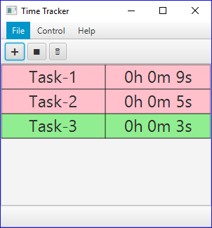

# Time-Tracker 
This project is to help remind me how much time I have spent on certain tasks.

//TODO complete readme

## Main Interface
The main interface has three main components.

### Menu Bar
Standard Windows application feature, in the standard Windows application location.

#### File

##### Add Issue
Allows the user to add an issue to the time tracker. 
A user cannot input an issue without a name, however the URL field can be ommitted. If the URL field is present, the user can press on the name to be taken to the issue's location.
Once an issue has been added to the tracker, the timer will automatically switch to the new task and start logging time to it.

##### Clear Issues
Allows the user to remove all issues presently stored within the Time Tracker application. 
Note: this is irreversible

##### Close
Closes the application.

#### Control

##### Stop
Pauses the currently running timer. Can also be triggered by pressing Control + Q.

#### Help

### Button Bar
This is the series of buttons located just below the menu bar.

#### Plus
Refer to [Add Issue](#Add-Issue).

#### Trash
Refer to [Clear Issues](#Clear-Issues).

#### Stop
Refer to [Stop](#Stop).

### Timer Monitor
The timers themselves can be seen as a series of vertically stacked rows, each with two columns; the left column is the name of the task, the right column is the time spent on the task.

#### Name Field
If the user assigned a URL to their timer, it can be clicked on to access the file or webpage in the default application.

#### Timer Field
This is literally the entire reason you're using the application, and if you require a readme.md file to tell you what it is, you probably don't need this application. Sorry.

#### Context Menu
If the user right-clicks on a timer, some options are presented:

##### Show Work-Log
Displays the duration (in hours and minutes) along with the start time and date.

##### Add Milliseconds
Allows the user to adjust the time in milliseconds - the value can be negative or positive to add or remove time.
Here's a quick rundown of potentially useful timings:

| Time | Ms |
| --- | --- |
| 1 minute | 60000 |
| 5 minutes | 300000 |
| 10 minutes | 600000 |
| 15 minutes | 900000 |
| 30 minutes | 1800000 |
| 42 years | 1.325e+12 |

##### Remove
Allows the user to remove the selected timer within the Time Tracker application. 
Note: this is irreversible
